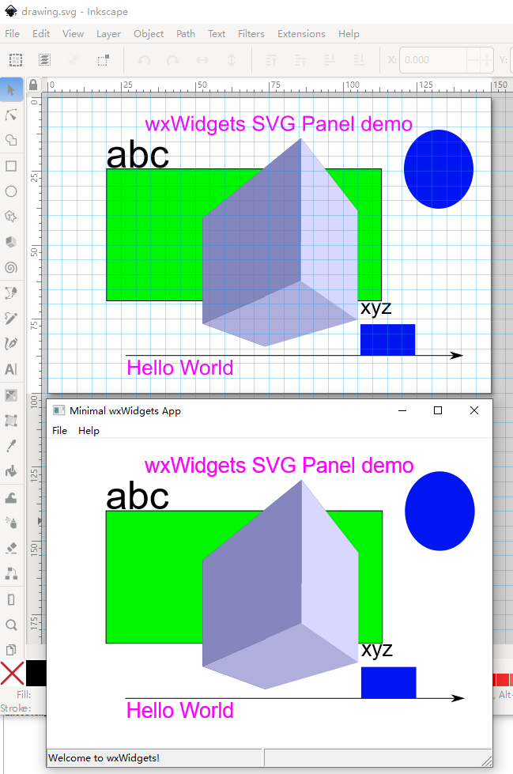

# SvgPanel
A wxPanel which can show svg image and simple text labels.

The code contains two parts:
1, original file `nanosvg.h` and `nanosvgrast.h` are from [memononen/nanosvg: Simple stupid SVG parser](https://github.com/memononen/nanosvg)
2, original file `svg_panel.h` and `svg_panel.cpp` are from doublemax's svg panel sources in [wxWidgets Discussion Forum - Index page](https://forums.wxwidgets.org/), see this post for details [Re: Use SVG Icons with wxDataViewCtrl (and others)](https://forums.wxwidgets.org/viewtopic.php?p=184852#p184852)

Note that currently,  [memononen/nanosvg: Simple stupid SVG parser](https://github.com/memononen/nanosvg) does not support parsing the `Text` field in `svg` file. I have modifed `nanosvg.h` to support parsing the `Text` field in the SVG file. I mainly followed commits in this pull request: [Adds basic text parsing by jamislike · Pull Request #94 · memononen/nanosvg](https://github.com/memononen/nanosvg/pull/94), but with some extra code changes, Also, I have merged from the latest master code of nanosvg.

The `svg_panel.h` and `svg_panel.cpp` files are modifed to extract the `Text` field and show them by wxWidgets' `DrawText` function. So, basically, the rasterizer from nanosvg is used to generated the background wxBitmap image, and later text labels were drawn on top of the wxBitmap image.

Here is the screen shot of a svg file `drawing.svg` shown in the panel compared with shown in the [Inkscape editor](https://inkscape.org/). You can also open the svg file in the web browser directly for a comparsion.

 

# How to use the code

Just copy/drag the 4 source files to your files, and construct a `SVGPanel` window where you needed.
